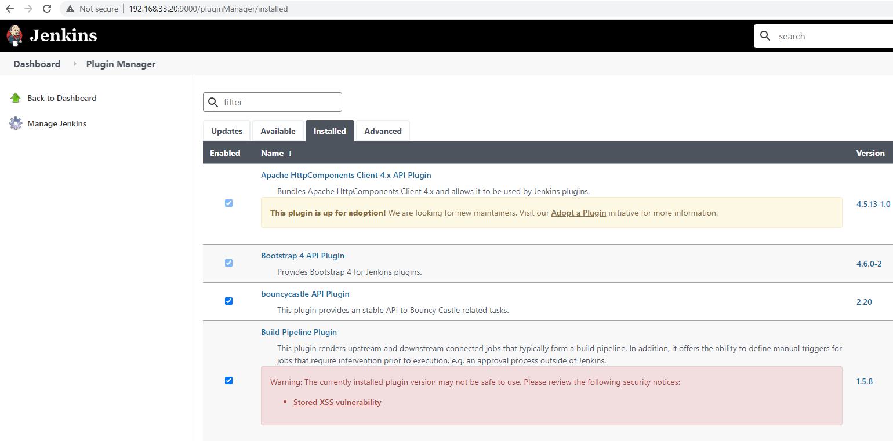

# Checkpoint

## Automatically configure a Jenkins server (anmcgill)

For this part of the assignment, we've defined a role in ansible for installing and configuring Jenkins. When running "pipeline setup," we're using ansible to install Jenkins and its dependencies, configure Jenkins to run on port 9000, disable the setup wizard for Jenkins, and install build-pipeline-plugin to support creating pipeline-style jobs.

The implementation in ansible attempts to follow the Jenkins documentation for installing from the command line on Debian/Ubuntu Linux distributions: https://www.jenkins.io/doc/book/installing/linux/#debianubuntu

We were able to verify that, after running "pipeline setup," we could access Jenkins from the UI as the admin user and see that the build pipeline plugin was installed:

We still need to update the setup command to handle the .vault-pass file.

In addition, we should probably revisit the implementation in ansible. What we have seems to work, but we may find there are issues with it as we make more progress on the other two sections of the milestone and begin interacting with the Jenkins server. We'll also want to make sure that we aren't violating any best practices in ansible or incorrectly integrating with the provided cm-template project.

One area for improvement is that the jenkins role in ansible will restart Jenkins twice every time it's run, even if nothing has changed. It's probably worthwhile to look into whether this can be avoided, maybe through the use of [handlers](https://docs.ansible.com/ansible/latest/user_guide/playbooks_handlers.html) in ansible.

## Automatically configure a build environment for checkbox.io (thwinter)

## Create a build job for Jenkins (sawalter)

We have the script written to configure the build job.  Still need to figure out how to make the authentication work automatically.  The screenshot below shows JJB creating the job and the resulting build in Jenkins.  The build currently fails because we have not yet installed all of the prerequisite services.

Once these three parts of the setup command are completed, we'll also need to implement the build command that will invoke our Jenkins job and print its log.
