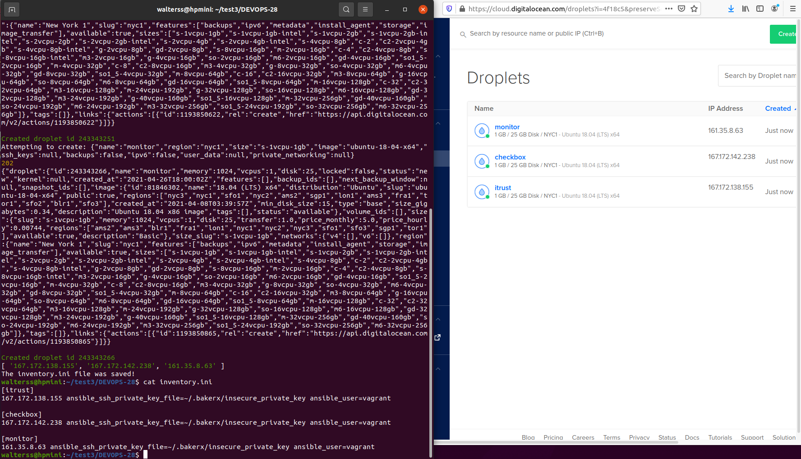
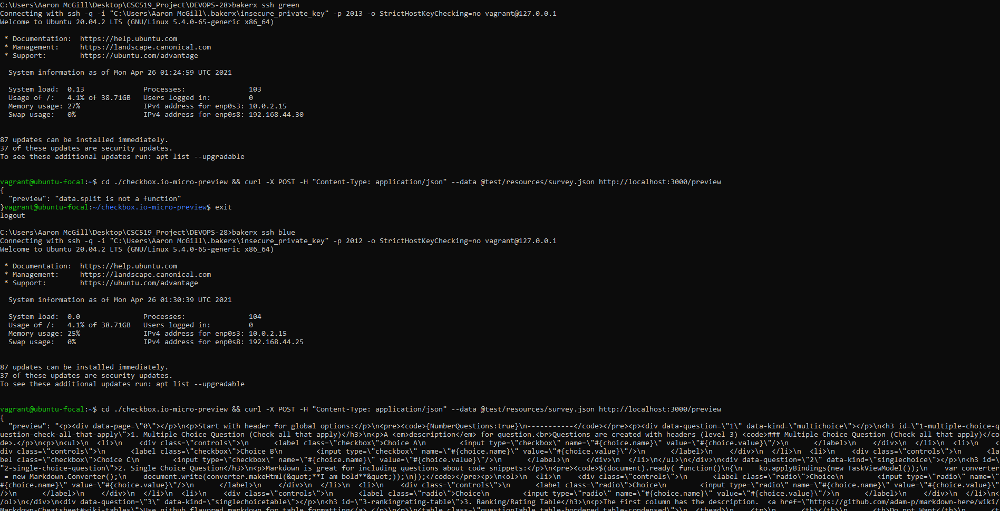

# Checkpoint

## Provision cloud instances (sawalter)

Created 'pipeline prod up' command.  Currently the command reads a Digital Ocean API token from a local environment variable called NCSU_DOTOKEN. The command makes use of code adapted from the cloud provisioning workshop to make REST requests to the Digital Ocean API to create 3 VMs (itrust, checkbox, and monitor).  Currently we are creating these instances in the nyc1 region using an ubuntu 18.04 LTS x64 image with 1GB of RAM and 1 CPU, though we can update this configuration as necessary.  The script then retrieves the IP address from the DO API, and uses them to output an inventory.ini file to the local filesystem, stored in the current working directory.  Attached is a screenshot showing the script being run, the contents of the resulting inventory.ini file, and the resulting 3 cloud instances on the Digital Ocean web interface.

## Deploy checkbox.io and iTrust (thwinter)

## Canary analysis (anmcgill)

We've begun to implement the canary command. The command currently just provisions the three VMs, clones the preview microservice project from the given branches onto the green and blue VMs, and starts the service on the VMs using pm2. This is being done via a shell script that is copied to the VMs, but it may make more sense to eventually install ansible and run a playbook to perform this setup.

While the proxy server isn't set up yet, we were able to verify that we could ssh onto the VMs and send a REST request to the preview endpoint after running the canary command to provision and configure the VMs:

The remaining work includes setting up the proxy server to control traffic to the green and blue deployments, implementing a monitoring service to gather metrics from the two VMs, performing canary analysis on the recorded metrics, and generating a report with the canary analysis and an indication of whether the canary passed or failed. For configuring the monitoring server, we expect to borrow heavily from the monitoring workshop code, and the proxy server configuration will be completed using logic from the deployment workshop.

To generate load for the canary analysis, we're currently planning to follow the example from the monitoring workshop and use the siege command line tool to generate traffic for one minute on the blue and green deployments. The tool would likely be installed on the monitoring VM.

Depending on how long all this takes, we may also try to tackle the bonus task and generate a monitoring dashboard for the deployed iTrust and checkbox.io applications, although we haven't spent much time looking into this yet.
