# HW0

## Moodle Profile Picture

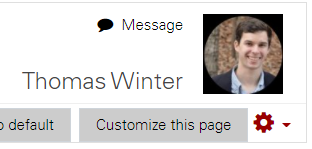

## Class Activities
### Welcome Message 

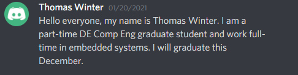

### Discussion

I was in the 8:00PM eu-west-1 Breakout Group. We talked about the differences between nightly builds, continuous integration, continuous delivery, and continuous deployment in Breakout.

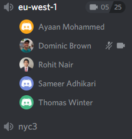

## Basics Workshop

Proof of Installing Software provided in the [Opunit Check](#opunit-checks) section.

### Customize Bash Prompt
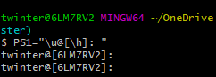

### [Data Science with Bash](Basics/data_science_bash_commands.txt)
1. Count the number of columns inside the “users.*.csv” file.
    ```
    head -n 1 product-hunt/users--2016-04-01_14-36-26-UTC.csv | tr ';' '\n' | wc -l
    ```

2. Count the number of times “bitcoin” is referenced inside a the post’s file “tagline” column. Tagline is the 4th column.
    ``` 
    cut -f 4 -d ';' product-hunt/posts--*.csv | grep bitcoin | wc -l 
    ```

3. Find the row of post with the highest number of votes (votes_count, 7th column).
    ``` 
    cut -f 1-14 -d ';' product-hunt/posts--*.csv | sort -t ';' -nrk7 | head -n1
    ```
### [About Me](Basics/AboutMe.md)

### Completed Git Levels
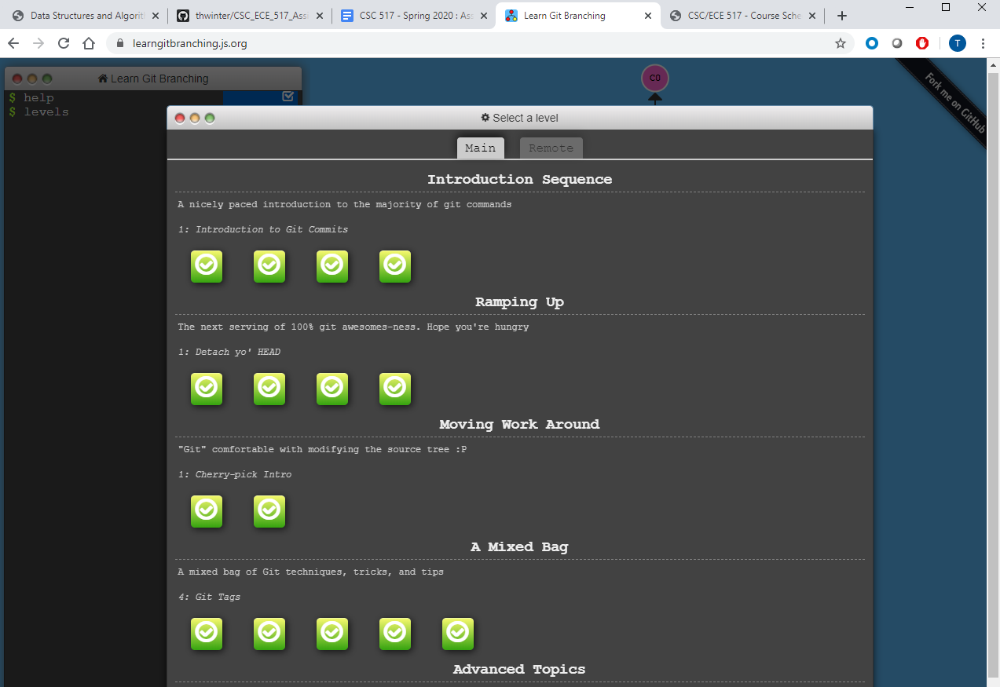

## Opunit Checks
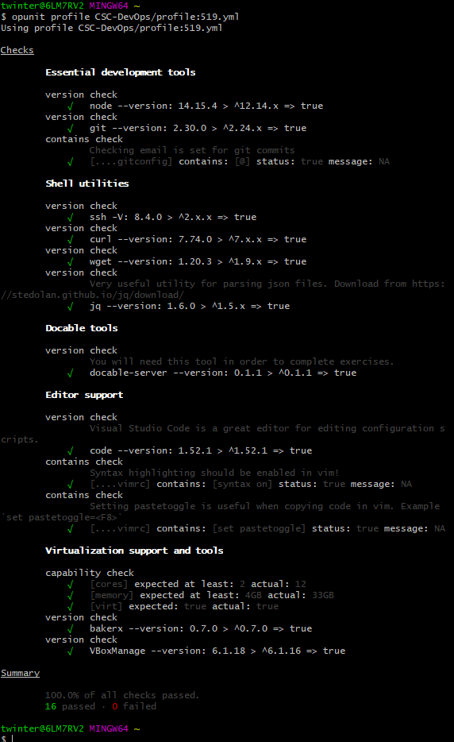

## Conceptual Questions
1. Explain class philosophy of "Understand how it works"

    **By understanding how a system works beyond just knowing how to make it work gives a deeper insight into how a system is connected and how it functions with the outside work. It also prepares the developer for future features/fixes; if all we know is how to make it work the first time, we won't know the needs of the system for it to grow and improve in the smartest/best way.**

2. What is heredoc, and why might it be useful?

    **A heredoc is a multi-line string of text inside of script that is treated as its own. It's useful because it is text literal, meaning no escape keys are needed to type an apostrophe, backslash, etc.**

3. Explain what does it mean by "Commits are NOT diffs"?

    **A commit is a snapshot of the current situation of the tree. Each individual commit also points back to its parent, and contains its own individual name and message. Each commit is a separate snapshot of the tree. The diff is comparing a snapshot in relation to its parent snapshot.**

4. What are signs of a bad kanban board?

    **If the board is empty, has too many items, or only contains general high-level items**

5. Why are nightly builds useful?

     **Nightly builds keep the codebase up-to-date more than waiting months later. The codebase can be tested/confirmed more frequently, and doesn't leave developers scrambling at the end to try and fix a mess of untested merged features. Also helps update very large codebases that take hours to update, so developers aren't waiting around during work hours.**

6. Explain "Every Feature is an Experiment"

    **No feature can every be 100% tested for all the situations the world will throw at it before it gets released, so the even though a feature may be released and "completed", it has tons of user testing that is about to occur. The user might want the feature to be changed to accomodate situations the developer never considered, or the development team my tweak color schemes here and there. The feature is always being tested for improvement and reliability.**

7. What does it mean by "Comfort the Customer with Discomfort"

    **The discomfort refers to the customer having to adapt to more frequent changes. Right when they get comfortable with using a software revision, then a newer/improved version is released and they need to become familiar with this new one instead. Their discomfort in having to be ready for changes in what they're used to brings them comfort in a better/improved product.**

8. Explain "You are the Support Person"

    **The developer is responsible to testing and troubleshooting their developed code. There is not a dedicated QA Engineer to test each developer's code, so the developer acts as the de facto QA department for their code**
    
9. Why can sharing an api key be problematic?

    **Because an api key is a unique identifier to each user. Sharing a key with someone with unknowingly bad intentions could provide them to use you as cover. They also have access to your own assets of that service, so you have given access to your "piggybank" to someone else**

10. What differences did you observe between the two cloud provider apis you tried?

    **I noticed that DigitalOcean needed the web address for each HTTP call, but AWS had all the specific web addresses provided by the internals of the API (I never needed to specify a web address with an HTTP function call). I also noticed that the API key for DigitalOcean needed to be manually saved as an environmental variable, but the AWS API key pair was saved directly into the ~/.aws/ folder when it was generated.**

## Provisioning Workshop

1. Get Regions

    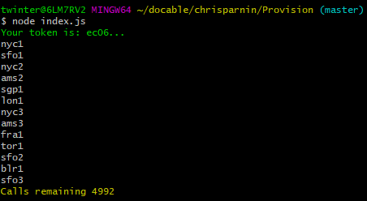

2. Get Images of nyc1 Region

    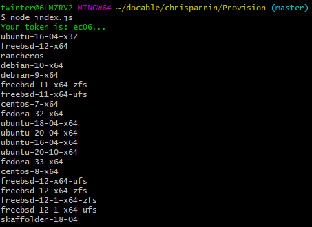

3. Create Droplet

    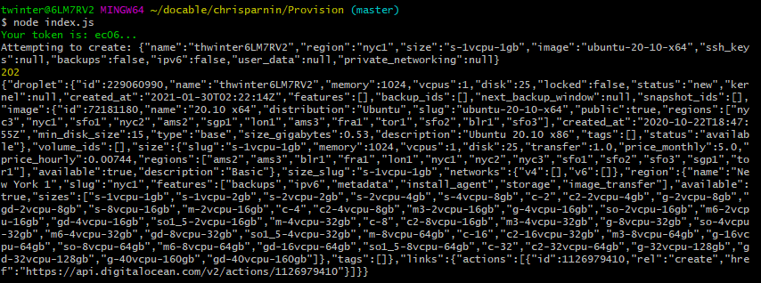

4. Get Droplet Information

    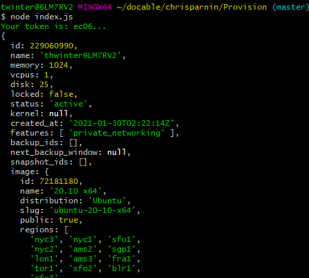

5. Ping Running Droplet's IP Address

    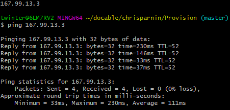

6. Delete Droplet

    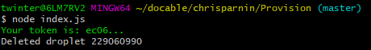

7. Ping Deleted Droplet's IP Address

    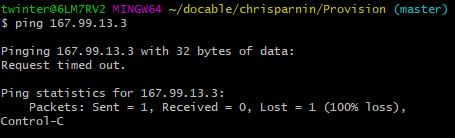

[**DigitalOcean Provisioning Code**](index.js)

## Provision with Additional Cloud Provider

1. Create Key Pair

    [Code](AWS_Provisioning/ec2_createkeypair.js) to create the Key Pair needed to create an instance of a virtual machine using AWS.

2. Create Instance

    [Code](AWS_Provisioning/ec2_createinstances.js) to create the Virtual Machine instance.

    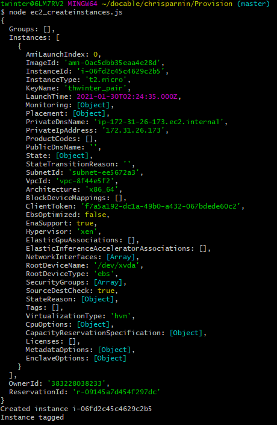

3. Get All Instance Details

    [Code](AWS_Provisioning/ec2_describeinstances.js) to get details of the instance.

4. Get Public IP Address of Instance

    [Code](AWS_Provisioning/ec2_getpublicipaddress.js) to get the public IP address of an instance given its ID. Step 5 contains command line proof.

5. Ping Running Instance's IP Address

    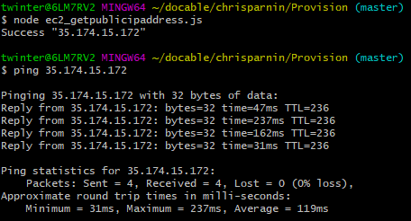

## Screencast

[**YouTube Link**](https://youtu.be/67hWggPckYI)