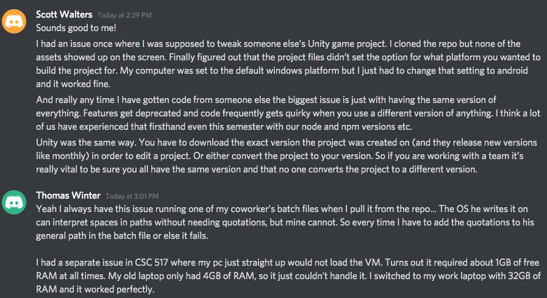
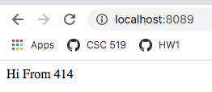
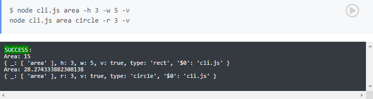
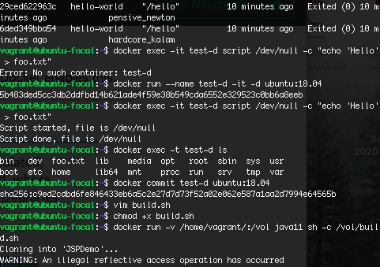
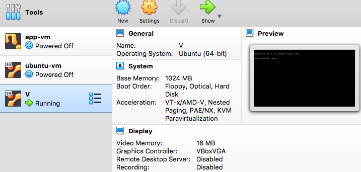
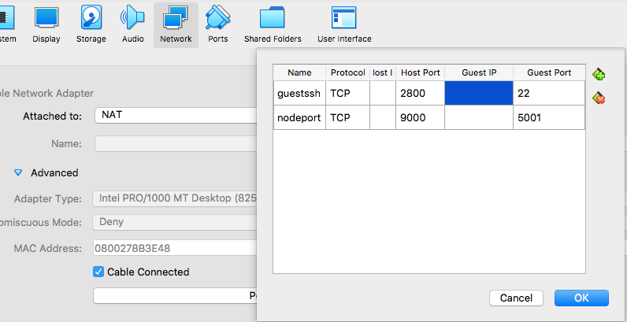
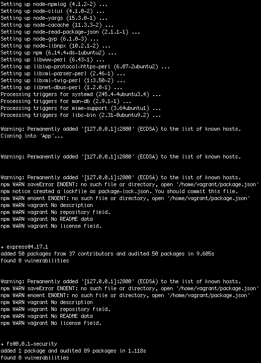
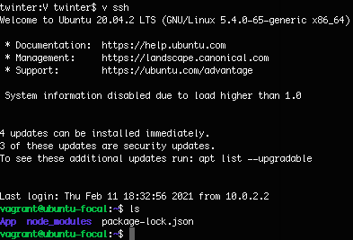
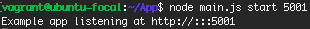
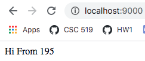

# HW1

## Class Activities

### Discussion

Scott Walters and I discussed our experiences with getting errors when running someone else's code on our own machines.



### Ubuntu Up Script

[My up-u.sh](up-u.sh)



### CLI Notebook

[My cli.js](cli.js)



### Docker Workshop

I explored using the Docker container to build an Ubuntu image on our Docker VM. A container is a collectoion of other objects that we can use to build images or other development tools. The Docker container is a great way to build an image based on other images, like we did with the Ubuntu 18.4 image in the workshop. Using the Dockerfile, we can build own our images.



### Conceptual Questions

* Why can code be difficult to run on another machine?

    **Because if a different machine does not have the same development environment, the machine might not have the right software/modules to run the code as the original machine could.**

* Explain the concepts of a computing environment and headless infrastructure.

    **A computing environment is the infrastructure built that software is developed where the software can be resilient and scalable. Headless infrastructure is a computing environment without a GUI.**

* Compare full emulation virtualization vs. binary translation.

    **Full emulation runs the virtual machine as a user application, and emulates the CPU, memory, network, and other aspects of a full machine. Binary translation does not require virtualization of the machine hardware; it instead translates the executable code of the virtual machine to the host machine to be able to run.**

* What are some use cases associated with microvms and unikernels?

    **MicroVMs are used in embedded appliances like Docker. Unikernel used in Lambda Machine Learning and FPGAs.**

* In VM workshop, why can't the eth0 ip address be pinged from the host?

    **Because the network is private to the VM, so it cannot be pinged from outside machines that are not in the network.**

* How can bakerx access the virtual machine through ssh?

    **Bakerx gets the private key and port from the VM, which it then uses for the host to gain access to the guest VM.**

* What are some of the limitations of using chroot for os-virtualization?

    **A limitation is that the chroot gives us root user access, so we have permission to delete necessary files for the OS. Deleting certain root files could corrupt the machine.**

* Why is the builder pattern useful for building images?

    **It allows us to build the new image by using older images to build upon and add development tools, then strip out the older image layer and keep the added development tools. This allows us to keep the new image small while adding tools from potentially multiple other images.**

## Virtual Machine Provisioning with CLI Program

[up.js](commands/up.js)

[ssh.js](commands/ssh.js)



### VM Setup



### Post-Configuration



### SSH and App

```
v ssh 
```



```
node main.js start 5001
```



```
localhost:9000
```



## Screencast

[Youtube Link](http://youtu.be/nNbV_pMRGRY?hd=1)
