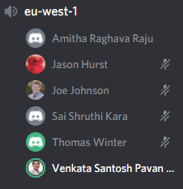
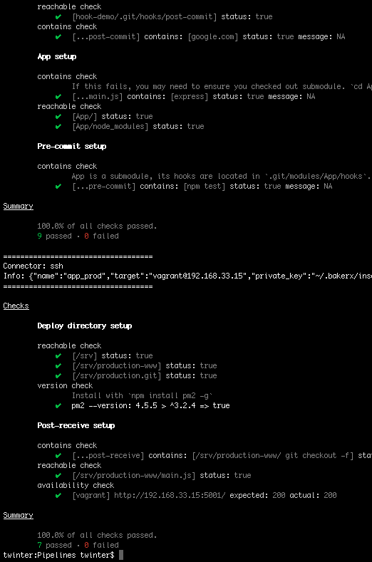

# HW3

## Class Discussion

Describe your discussion for continuous integration. What positive experience did you share? What was a negative experience that someone shared?

**I was in the eu-west-1 chatroom on 3/2. The positive experience with CI that I shared was when we utilized it in CSC517 for an open-source project. It was great to receive feedback in minutes on whether the build passed and what might have caused it to fail. The negative experience that someone shared was in one of their NCSU classes, the CI machines were bogged down when the deadline was just hours away. There were tons of students trying to submit/check their builds at the same time, so the queue was getting longer and longer. The person was concerned that their project might miss the submission deadline while waiting to be checked by Jenkins.**

## Conceptual Questions

* Why is a pipeline useful architecture for supporting continuous deployment?

    **Because a pipeline gives us a set of checkpoints that the new pushed code must pass in order to be deployed into the environment. Every commit must pass through this road to deployment, and if it fails to pass one of the checkpoints, it is not deployed because it would be detrimental to the overall codebase. This allows a uniform system of checking to make sure every commit can mesh with the codebase without causing direct damage.**

* What is the primary principle of CI?

    **Developers automatically build, test, and analyze a software change in response to every software change that has been committed to the repository.**

* What are some claimed benefits of CI that are supported by empirical evidence?

    **Detecting defects and fixing them faster, reducing repetitive processes to reduce time and cost, and helps deploy more often.**

* Why can troubleshooting a CI build failure be difficult?

    **It can be difficult and time-consuming to parse through the error log because it can be a really long and verbose log.**

* In the lecture, what characteristics did the four build manager tools have in commmon, how did they differ?

    **All four of the build managers have a set of tasks that they run through for each stage of the pipeline, and each stage is called individually in the terminal. They differ in the language that they are written in: npm is written as a JSON object, grunt is in JavaScript, make is written in tab form, and maven is written in XML form.**

* Based on the reading, summarize desirable proproperties of the Build phase.

    **The Build should check all dependencies are present and is completed in a timely manner that includes all necessary commands. This process should be the same for every iteration and each iteration should not depend on any otehr iteration.**

* How might we verify a pipeline works correctly?

    **We could track all of the outputs and check who reads those outputs in cases where builds are interfering with one another. Another name for this is Taint Analysis.**

* Trace the flow of a commit from the local App repository to running code in production. Can you see how it maps to the pipeline diagram?

    **The pre-commit hook in the host App directory is run, and those tests are passed. Then when the commit is pushed to the production repo, the changes are written the production App repo. Then the post-receive hook steps are completed and the app is installed in the production-www folder. Then the pw2 utility is used to stop the app and then deploy the app.**

* What are some issues that might occur if required to pass tests in a pre-commit hook?

    **I could see it could slow down development time if every single commit is required to pass a large set of pre-commit tests. The pre-commit tests aren't really testing if the build will break/pass, so these unit tests could just be run ad-hoc instead of automatically for every commit.**

* What are some issues that could occur when running npm install (when testing), and then npm install again in deployment?

    **It can use up a lot of CPU and time to install the same dependencies in the production environment. Or if the deployed build has some restricted internet access, it might not be able to install all of the dependencies.**

* Why is pm2 needed? What problems does this solve? What other problems might exist in more complex applications that our pipeline does not address?

    **pm2 ensures that the App stays running even if crashes. This solves having to manually redeploy the build if the app happens to crash. It does not seem like the Post Deploy checking is included, we have pm2 to keep things running, but nothing to check to make sure everything is running fine.**

* What are other stages of the pipeline that are missing?

    **We also have not Static Code Analysis to check for common problematic coding patterns.**

## Completion of Pipelines Workshop

* What did you learn in the pipelines workshop?

    **I learned how to use hooks to run tests/actions before and after certain parts of code commits and deployments. I didn't realize you could do that with git.**

* What problems did you encounter?

    **I forgot to change the owner of the /srv/ from the root, so I did not have access when trying to push the commit from my host computer.**

* Document the completion of the Pipelines workshop with a screen shot of passing opunit check.

    