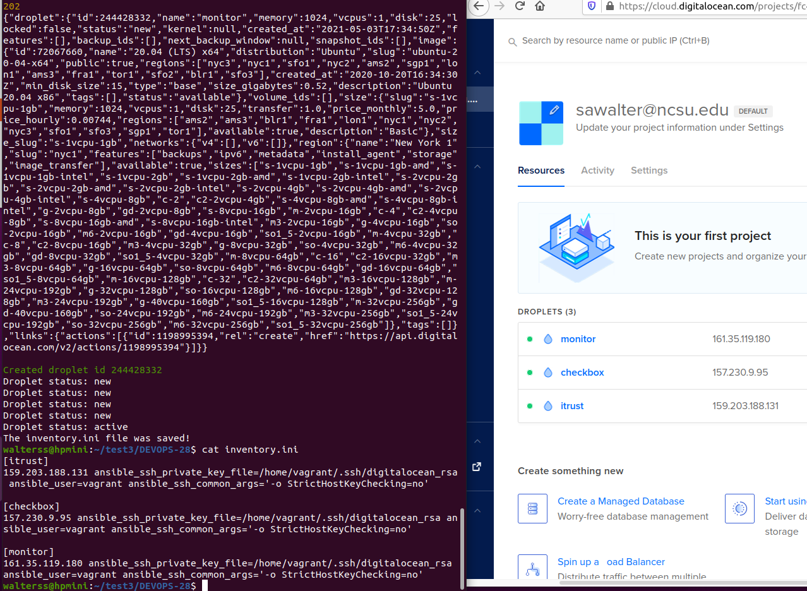

# CSC 519 Project

## Milestone 1
For information about Milestone 1, see our [README](https://github.ncsu.edu/cscdevops-spring2021/DEVOPS-28/blob/M1/README.md) for that milestone.

## Milestone 2
For information about Milestone 2, see our [README](https://github.ncsu.edu/cscdevops-spring2021/DEVOPS-28/blob/M2/README.md) for that milestone.

## Milestone 3
Issue board for this milestone: https://github.ncsu.edu/cscdevops-spring2021/DEVOPS-28/projects/3

[April 26th checkpoint report](CHECKPOINT.md)

### Screencast

TODO

### Instructions for running the code

1. Clone the git repository locally.
2. In the project directory, run `npm install`
3. In the project directory, run `npm link`
4. Create a file in the project directory named ".vault-pass".  Inside the file, store the password for the ansible vault.
5. In the project directory, run the command `pipeline setup --gh-user <Your GitHub Account Name> --gh-pass <GitHub API Key>`.  This GitHub account must have access to clone the private iTrust2 repository.
6. In the project directory, run the command `pipeline prod up` to create the remote instances on Digital Ocean.  This command requires a Digital Ocean API key to be stored in a NCSU_DOTOKEN environment variable.
7. In the project directory, run the command `pipeline monitor-setup -i inventory.ini` to set up the monitoring infrastructure on the specified infrastructure.
8. In the project directory, run the command `pipeline build checkbox.io -i inventory.ini` to deploy checkbox.io to the given inventory.
9. In the project directory, run the command `pipeline build iTrust -u <jenkins-user-id> -p <jenkins-password>` to trigger the Jenkins build job for iTrust and create a war file for deployment.
10. In the project directory, run the command `pipeline deploy iTrust -i inventory.ini` to deploy iTrust to the given inventory.
11. In the project directory, run the command `pipeline canary master broken` to construct canary infrastructure, collect data, and perform analysis on the given branches.

## Provision cloud instances (sawalter)

We provisioned our cloud instances in a [prod.js](commands/prod.js) script in our project.  We elected to use Digital Ocean for our remote instances.  The script requires an environment variable, NCSU_DOTOKEN, to be set containing an API key for Digital Ocean.  The script provisions 3 remote VMs, itrust, checkbox, and monitor. This is accomplished by first generating an ssh keypair for automatic authentication between the configuration management server and the remote droplets, which is stored in the configuration management server's home/.ssh directory.  We then create each droplet on Digital Ocean.  After the creation of a droplet, a helper function is used to poll the droplet every 5 seconds to determine when it has transitioned from the "new" to an "active" state, at which point we will be able to connect to or deploy to the newly created droplet.  We then query the droplets to obtain their IP addresses.  Finally, the script outputs an ansible compatible inventory.ini file that can be used when deploying jobs to the remote droplets.

The screenshot below shows the completion of the prod up script, the resulting inventory.ini file, and the instances created in Digital Ocean as a result.



### Challenges
We initially created the prod up script in a linux environment.  When other team members who were on a Windows environment attempted ro run the script, however, the ssh keypair was not written to the file system, causing the script to fail.  After troubleshooting the problem, we determined that the node plugin being used to create the keypair was not compatible with a windows environment, due to permissions issues on the filesystem.  We were able to analyze the plugin code, however, and create our own script based on the plugin's code that was Linux and Windows compatible.  We were then able to successfully write the keypair to the filesystem.

This fix created an additional problem, however, where the deploy script failed because the newly created ssh keypair files could not be used for authentication by ssh, as the permissions were to open for ssh to allow the file to be read.  Again, this was not a problem for people using Linux, but did occur for users on Windows.  Additionally, it proved impossible for a Windows user to modify the permissions of the file, as it was in the /bakerx directory.  Our solution was to copy the keypair files into the config-srv user's home directory, at which point we were able to midufy the permissions, and the script could complete successfully.

## Deploy checkbox.io and iTrust (thwinter)

## Canary analysis (anmcgill)

The canary command is implemented in a [canary.js](commands/canary.js) file in this project. The command provisions three VMs, one for the blue deployment, one for the green deployment, and one for the proxy deployment. The command assumes that the first argument represents the branch to clone on the blue deployment, and the second argument represents the branch to clone on the green deployment. For example, the command `pipeline canary master broken` will result in the master branch of the preview microservice repo getting cloned on the blue deployment and the broken branch getting cloned on the green deployment. Shell scripts are used to install dependencies, start the preview microservice, and configure and start Redis. The siege command line tool is installed on the proxy server. An [index.js](agent/index.js) file is copied to the green and blue VMs and run to publish CPU and memory usage metrics to the Redis instance running on the proxy server. We use forever for launching the agent and preview microservice processes on the green and blue VMs.

Once the VMs are configured, a [proxy.js](lib/proxy.js) file is run on the proxy VM. This script sets up the proxy server, uses Redis to subscribe to the metrics published by the agents on the blue and green VMs, and runs the siege tool on the proxy VM to direct traffic to the blue and green VMs. The script also calls the proxy endpoint to generate metrics related to calling the API. The siege tool is running for a minute on the blue VM. After this, the target deployment for the proxy is switched to the green VM and the siege tool is run against the green VM for a minute. Once this is complete, a canary report is generated using the metrics we've collected.

We selected five metrics for our canary analysis:

1. Memory usage
2. CPU usage
3. Latency
4. Number of failed requests (based on status code)
5. Size of responses from /preview endpoint

For the fourth metric, we keep track of a list of numbers. These numbers can be either 0 or 1, where 0 represents a successful request (a 200 status code) and a 1 represents an unsuccessful request (a non-200 status code).

We use the gist provided in the assignment, which is in a [mannwhitneyu.js](lib/mannwhitneyu.js) file, to perform Mann-Whitney U analysis on each metric. We run one-sided analysis twice on each metric so we can determine if the metric is too high or too low. To determine if the metrics are significantly different for the two VMs, we check the p-value returned by the two rounds of Mann-Whitney U analysis. We consider a metric "failed" if it is significantly lower or greater for the green deployment. The canary score we calculate is: `Number of passed metrics / Total number of metrics.`

We consider the canary failed if the canary score is less than 40%, indicating that at least four of our five metrics failed.

Here is an example report from running `pipeline canary master master`:
```
==============================================================================================
CANARY REPORT:

MEMORY LOAD: HIGH
CPU LOAD: PASS
LATENCY: PASS
FAILED REQUESTS: PASS
RESPONSE SIZES: PASS

FINAL CANARY SCORE = (4 / 5) = 80%
CANARY PASSED!
==============================================================================================
```

And here is an example report from running `pipeline canary master broken`:
```
==============================================================================================
CANARY REPORT:

MEMORY LOAD: LOW
CPU LOAD: LOW
LATENCY: LOW
FAILED REQUESTS: HIGH
RESPONSE SIZES: LOW

FINAL CANARY SCORE = (0 / 5) = 0%
CANARY FAILED!
==============================================================================================
```

### Challenges

We ran into socket errors when running siege on the green VM. To work around this, we decided to reduce the number of concurrent clients to five by setting -c5 when calling siege. We're also setting the delay for seige to one second by specifying a -d1 argument.

We've found that our memory usage, CPU usage, and latency metrics are not completely reliable. Our canary analysis will sometimes identify these metrics as significantly different for the two VMs even when they're both running from the master branch. We looked into tweaking the metrics, but did not have much success. For example, the systemInformation module allows you to retrieve the CPU and memory usage for individual processes rather than the system, and we tried just looking at the metrics for node processes running on the VMs, but we still encountered the same intermittent issues. Given more time, we could make these metrics more robust and define a stricter threshold for failing the canary build.
