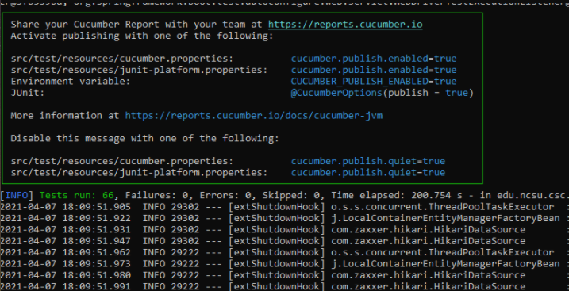
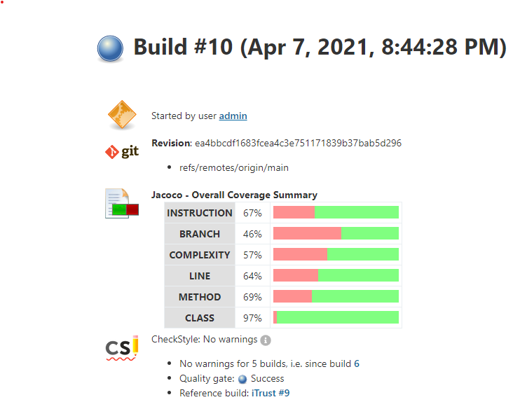

# CSC 519 Project

## Milestone 1
For information about Milestone 1, see our [README](https://github.ncsu.edu/cscdevops-spring2021/DEVOPS-28/blob/M1/README.md) for that milestone.

## Milestone 2
Issue board for this milestone: https://github.ncsu.edu/cscdevops-spring2021/DEVOPS-28/projects/2

[March 29th checkpoint report](CHECKPOINT.md)

### Screencast

TODO

### Instructions for running the code

1. Clone the git repository locally.
2. In the project directory, run `npm install`
3. In the project directory, run `npm link`
4. Create a file in the project directory named ".vault-pass".  Inside the file, store the password for the ansible vault.
5. In the project directory, run the command `pipeline setup --gh-user <Your GitHub Account Name> --gh-pass <GitHub API Key>`.
6. In the project directory, run the command `pipeline build iTrust -u <jenkins-user-id> -p <jenkins-password>`
7. In the project directory, run the command `pipeline useful-tests -c 1000 --gh-user <Your GitHub Account Name> --gh-pass <GitHub API Key>`
8. In the project directory, run the command `pipeline build checkbox.io`.  Optionally, you may specify a username and password for Jenkins with the command `pipeline build checkbox.io -u <jenkins-user-id> -p <jenkins-password>`

### Automatically configure a build environment and build job for iTrust (thwinter)

For this task, we needed to extend the [Setup command](commands/setup.js) to take in the user's GitHub account username and password as arguments. A GitHub developer API key is required to be used as the password argument because this is the best way to get cloning access to the iTrust repository that will be used in the Jenkins Job Builder.

The iTrust application requires Java, Maven, MySQL, and Chrome in order to be fully functional. These applications were added to the [Environment task](cm/roles/environment/tasks/main.yml) installation list so that they would be automatically installed when the `pipeline setup` command is used. We also needed to create a MySQL user with a password in order to run SQL commands. Additionally, we stored the GitHub credentials in the Jenkins credentials manager so that they would be stored during the setup process and could be used during the Jenkins Job Builder phase.

In order to add the iTrust job to the JBB, we altered the now [create_job script](cm/build-scripts/create_job.sh) to create a job that depends on the name argument of the [Build command](commands/build.js). The name for argument needs to be one of the YAML files located in [cm/build_scripts/jjb-jobs](cm/build-scripts/jjb-jobs), and it will run the job in the respective YAML file for the given name argument.

The [iTrust build job](cm/build-scripts/jjb-jobs/iTrust.yml) steps are then run when the user types in `pipeline build iTrust -u <user> -p <password>`: 

1. The build job checks out the iTrust repository from the NCSU GitHub using the account username and API key given in the Setup command, but has since been stored as the Jenkins credentials.
2. The build job then copies the [application.yml](application.yml) information from the /bakerx/ location and into the iTrust application.yml file.
3. The Maven tests, integration tests, and checkstyle tests are then run.
4. The Code Coverge is then calculated using the added JaCoCo plugin for Jenkins. We utilized build gates to make sure the build fails if the code coverage is not a certain percentage.
5. The Jenkins function recordIssues from the warnings-ng Jenkins plugin is then utilized to use the checkstyle test results. If there are any checkstyle errors, the build is gated so that it will fail.
6. We then run some clean up steps regardless of whether the build succeeds or fails. We log into MySQL and drop the iTrust2_test database if it exists, then kill all Google Chrome processes, and then kill stray jetty processes on port 9001 using the fuser unix command.
7. Finally, we run the general cleanWS() function to clean the Jenkins workspace.

Passing Cucumber Tests:



JaCoCo and CheckStyle reports:



We were able to successfully automatically configure the environment using Ansible and then automatically create a Jenkins build job to analyze and test the iTrust repository.

An issue we ran into was that setting the maximum JaCoCo thresholds for build gating to higher than the code coverage actually caused an unstable build. It turns out that the maximum setting is kind of a misnomer for just a larger code coverage threshold than the minimum JaCoCo threshold.

Another issue we ran into was the MBean server could not connect at port 9001. It turned out that because our VM's RAM was too low for that step to complete before the timeout countdown had been reached. We increased the RAM from 2GB to 4GB and the issue was resolved.

### Implement a test suite analysis for detecting useful tests (anmcgill)

For this task, we defined a [driver.js](lib/driver.js) script that is run on the VM. This script uses a [mutate.js](lib/mutate.js) file to generate mutations.

The useful-tests command we defined first clones the iTrust repo and copies an application.yml file into the cloned project to configure the tests. The application.yml file uses a MYSQL_PASSWORD environment variable that is defined in our "environment" ansible role when MySQL is initially installed and configured. The command then calls the driver.js script, passing in the specified number of iterations.

The driver.js script extends the fuzzing workshop code to randomly select a file for each iteration, apply mutations to that file, attempt to compile the project using `mvn compile`, and then run tests using `mvn clean test`. It extends the test suite analysis code to parse the resulting XML files into a data structure and track the results for each test case over time. At the end of each iteration, the script drops the database generated by iTrust and resets the state of the mutated file.

The driver.js script has retry logic that handles these two cases:

1. The project failed to compile with the generated mutations. In this case, we discard the changes made to the file and try to select another file and mutate it.
2. A file was selected but mutations could not be generated. This could happen with several files in the iTrust project. For example, there's not much you can do with the repository interfaces. In this case, we just select another file and try to apply mutations to it.

We were asked to select two mutations in addition to those listed in the assignment, and these were the mutations we ultimately went with:

1. Replace && with ||
2. Replace return statements with `return null;`. For example, `return someValue;` or `return object.someMethod();` could both be replaced with `return null;`.

We initially had a different second mutation, but we found that we were hitting a lot of files where we couldn't mutate anything. The return statements mutation could be applied to most files, which is one of the reasons we decided to use it.

As the mutations are generated, they're written out to a /home/vagrant/mutations directory on the VM. The files within this directory are referenced from the test report.

The full output from running with 1,000 iterations is [here](usefulTests.txt). If you want to just see the report itself without all that debug output, that's also available in a [separate file](usefulTestsReport.txt).

The test suite found about 60% of the mutations, and the testDiagnoses test case within the APIDiagnosisTest class was the most effective at catching mutations:

```
Overall mutation coverage: 601/1000 (60.099999999999994%) mutations caught by the test suite.

Useful tests
============
271/1000 edu.ncsu.csc.iTrust2.api.APIDiagnosisTest.testDiagnoses
...
```

### Implement a static analysis for checkbox.io (sawalter)

For this task, we created a script, [analysis.js](/lib/analysis.js), based on the workshop code to run static analysis on the checkbox.io Jenkins job.  These tests include checking for long methods (greater than 100 lines of code), long message chains (more than 10 chained . commands after the initial reference), and excessive nesting depth (more than 5 deep).  This script is executed on every .js file in the checkbox.io repository, excluding those contained in the node_modules directory.  

Originally, we executed a shell command in the jenkins job script using find... exec to execute the script on these files.  Per the requirements, we need to fail the Jenkins build job when any of these conditions are violated.  To accomplish this, we decided to set a non-zero exit code of 1 any time one of these violation are detected.  We could then add up the exit code values from the analysis on each file, ultimately obtaining a calculation of the number of files containing violations, and if this number was greater than 1, could fail the build.  A limitation of using find... exec, however, was that the individual exit codes from each run of the analysis.js script were not retained.  In order to retain the exit codes, we instead decided to use a bash script, [staticAnalysis.sh](/cm/build-scripts/jjb-jobs/staticAnalysis.sh), implementing a for loop to cycle through each .js file, and storing the exit code after each run.  We then have the script return an exit code equal to the sum of the failures.  This script is run using the shell command in the Jenkins job.  Any time Jenkins receives a non-zero exit code, the build is automatically failed and immediately terminates.  

In order to continue Jenkins running the 'Test' stage even after a failure in the Static Analysis stage, we used the newly implemented catchError() command in Jenkins, which allowed us to specify that we wanted to fail the Static Analysis stage as well as failing the build, while not immediately terminating the build, allowing the later stages to run.  The screenshot below shows the final state of the build, with the Source, Build, and Test stages passing in green, and the Static Analysis stage failing in red.  The red ball indicates that the entire build failed as a result of the failing stage.


The Jenkins build log is also shown below, depicting both methods that passed the static analysis tests, as well as the errors for the three different types of failures.


