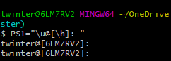
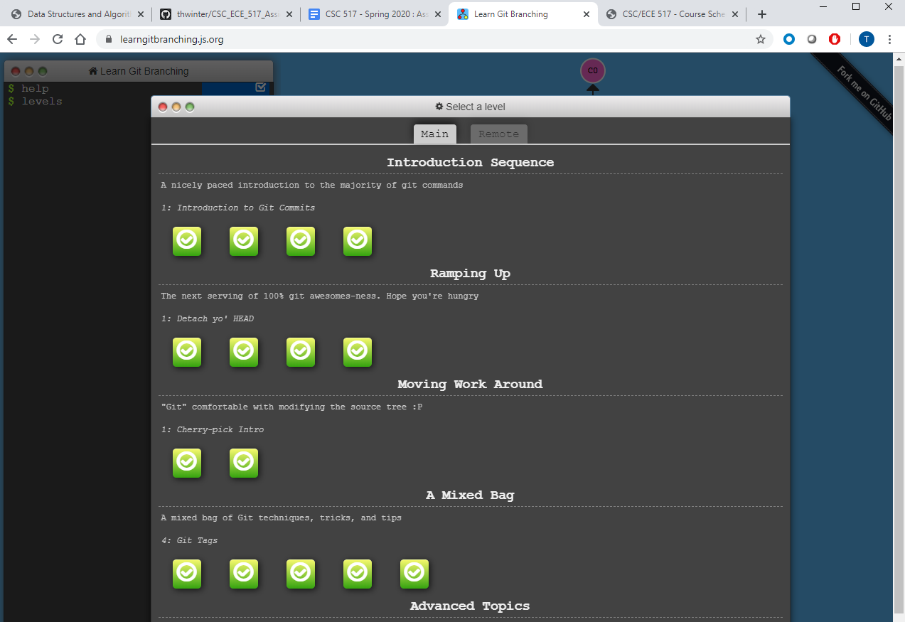
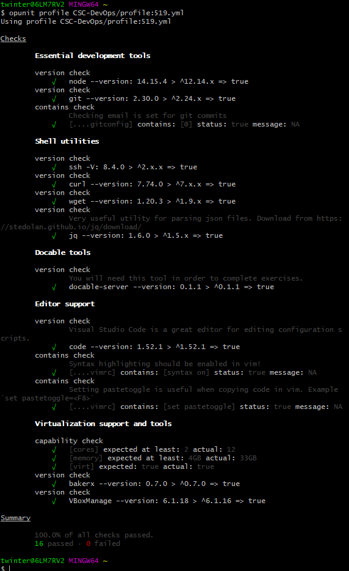

# HW0

## Class Activities

## Basics Workshop

### Customize Bash Prompt


### [Data Science with Bash](Basics/data_science_bash_commands.txt)
1. Count the number of columns inside the “users.*.csv” file.
    ```
    head -n 1 product-hunt/users--2016-04-01_14-36-26-UTC.csv | tr ';' '\n' | wc -l
    ```

2. Count the number of times “bitcoin” is referenced inside a the post’s file “tagline” column. Tagline is the 4th column.
    ``` 
    cut -f 4 -d ';' product-hunt/posts--*.csv | grep bitcoin | wc -l 
    ```

3. Find the row of post with the highest number of votes (votes_count, 7th column).
    ``` 
    cut -f 1-14 -d ';' product-hunt/posts--*.csv | sort -t ';' -nrk7 | head -n1
    ```
### [About Me](Basics/AboutMe.md)

### [Completed Git Levels]


## Opunit Checks


## Conceptual Questions
1. Explain class philosophy of "Understand how it works"

2. What is heredoc, and why might it be useful?
3. Explain what does it mean by "Commits are NOT diffs"?
4. What are signs of a bad kanban board?

    **If the board is empty, has too many items, or only contains general high-level items**
    
5. Why are nightly builds useful?

     **Nightly builds keep the codebase up-to-date more than waiting months later. The codebase can be tested/confirmed more frequently, and doesn't leave developers scrambling at the end to try and fix a mess of untested merged features. Also helps update very large codebases that take hours to update, so developers aren't waiting around during work hours.**

6. Explain "Every Feature is an Experiment"
7. What does it mean by "Comfort the Customer with Discomfort"
8. Explain "You are the Support Person"

    **The developer is responsible to testing and troubleshooting their developed code. There is not a dedicated QA Engineer to test each developer's code, so the developer acts as the de facto QA department for their code**
    
9. Why can sharing an api key be problematic?
10. What differences did you observe between the two cloud provider apis you tried? 

## Provisioning Workshop

## Provision with Additional Cloud Provider

## Screencast