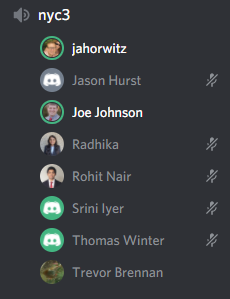
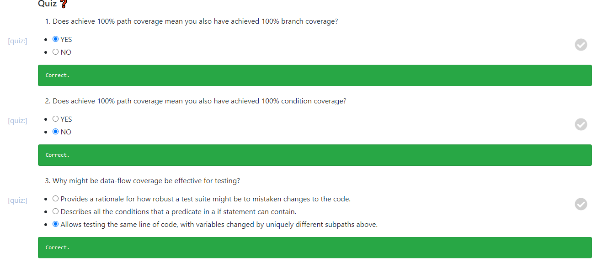
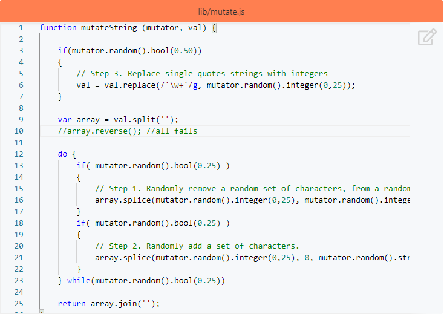

# HW4

## Class discussion

I was in the nyc3 discussion on 3/9/21.

What are some tradeoffs in having lots of unit tests and/or UI/integration tests in a CI pipeline?

**We talked about how having lots of unit tests in a CI pipeline may add tons of build time over the course of many builds. While code coverage should increase with the more unit tests you have, it will add to the build time overall.**

What are some reasons why 100% test coverage (i.e. statement coverage), might be difficult, impossible, impractical, or even counter-productive to achieve in practice.

**100% test coverage can be counter-productive, say, if you have a switch statement doing generally the same function but for different variables depending on the switch variable. If there are tens/hundreds of cases, you'll spend so much time writing tests to cover every test when those tests generally are testing the same thing. You'll spend a lot of time just repeating what another unit test is accomplishing for a different case in the switch statement.**

## Conceptual Questions

* What are the two different senses of testing and how do they differ?

    **The first sense is Discovery where the intent is to find errors through testing, while the other sense is Verify where the intent is to find if the program passes the required components.**

* What is the goal of code coverage?

    **To show the percentage/amount of lines of code that are run through while running the set of tests. This shows how much of the code is being tested. Goal is to decrease the chance of having a fault.**

* Does condition coverage imply branch coverage? Why not?

    **No because you could cover every line of code in an if/else-if structure, but might miss the hidden else statement that is not necessarily required to be written, but is still a possible branch in the code structure.**

* Why might be data-flow coverage be a more effective criteria for testing than achieving path coverage?

    **Because it covers all the cases when variables could be changed. Paths where the variables remain the same are no longer included in the test suite, which reduces test count and testing time but still covers the necessary test conditions.**

* What is the primary limitation of mutation coverage?

    ****

* How can an acceptance test be automated while still allowing human review?

    ****

* Why might the failure rate of a test be useful to know when analyzing a test suite?

    ****

* What's the highest level of flakyness a test can achieve and why? Hint: Think what behavior are purely random decision would be?

    ****

* What is the difference between generative and mutation-based fuzzing techniques?

    **Generative testing is given known and consistent inputs into the program, while fuzzing is a random assortment of inputs to test if the program can handle errors/failures correctly.**

* Why might minification of fuzzing inputs be useful for debugging an fault?

    ****

* Why regex isn't enough for performing static analysis?

    ****

* When implementing a code smell detector, how might you detect duplicated code?

    ****

* Why is an visitor pattern using technique for writing static analysis based code checks?

    ****

* How might advanced analysis techniques such as statistical analysis or automated program repair impact the design and usage of an automated software pipeline?

    ****

## Coverage Calculation

There are 3 branches at the top level with if(c && b), else if(a), and else. Within the if(a) branch, there is a if(b) branch that splits into 2 more branches called if(b) and else. Within the if(b) branch, there is another split into 2 more branches called if(c) and else. Within the if(c) branch, there is another split into 2 more branches called console.log and else. All 7 of these branches merge and then we face another branch for the condition if(a||b||c), which splits into 2 branches of returning 0 if true and returning 1 for the else. In total there are 9 branches. The first test case covers 2 of these branches and the second test case covers a separate 2 branches. **In total the branch coverage is 4/9.**

## Workshops

### Coverage Workshop

### Fuzzing Workshop

[Mutate Script](./mutate.js)

