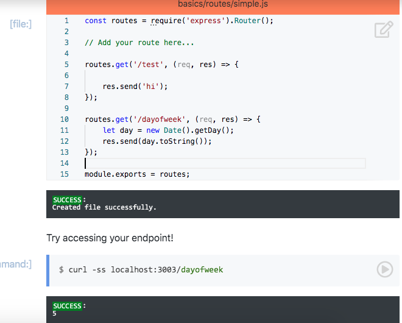
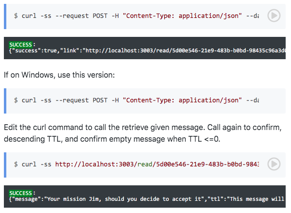

# HW5

## Task 1 

## Task 2

## Task 3

## Task 4

## Task 5

## Conceptual Questions

* Describe three desirable properties for infrastructure.
    
    **One property is Availbility, meaning you want your application to be available at all times to all users. You don't want to have an interruption in the service that your application provides. Another property is Scalable, meaning your infrastructure is able to adapt/grow for a potential increase in the amount of users or computing demand for your application. A third property is Isolation, meaning you don't want your application having so many interconnected components that depend on one another. If one component has a bug, you don't want that to break all other components of your application and then you have to deal with getting them all to behave well with one another.**

* Describe some benefits and issues related to using Load Balancers.
    
    **The Load Balancer ensures Availability and Scalability by sending traffic to healthy instances and preventing traffic from flowing to unhealthy/broken instances. It also has the ability to request more instances if traffic to all of the healthy instances is starting to become too high. An issue related to Load Balancers is if a Load Balancer goes down, then a human has to manually balance and monitor the incoming traffic, but there is typically low risk for this occurring.**

* What are some reasons for keeping servers in seperate availability zones?
    
    **To isolate one instance from another instance so that if one instance fails, the other one is not affected. To switch requests when deploying a new version. To avoid slow start up by anticipating a large traffic boost.**

* Describe the Circuit Breaker and Bulkhead pattern.
    
    **Bulkheads isolate components and protect cascading failures using load shedding. This puts a limit on the amount of requests the service can receive; if that limit is surpassed, the system simply ignores all of those additional requests. Circuit Breakers stop making requests to faulty services by cutting off access to the service if there have been too many recent faults using that service.**

## Screencast