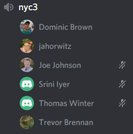

# HW2

## Class Discussion

Describe your discussion for defining idempotency. What examples did you use for idempotent and not idempotent operations?

**I was in the nyc3 chatroom on 2/16. We talked about how idempotent operations can be done multiple times in a row without the result changing, while non-idempotent operations have a different result if repeated again. My example of an idempontent operation is an HTTP GET request, because the same JSON object should return as long as the database or server has not changed from the previous GET request. My example of a non-idempotent operation is an HTTP DELETE request because if you request to delete an existing object, the response will be a successful deletion if there are no errors. But if the operation is repeated for the same object, an error will occur because that object no longer exists because it has already been deleted; thus we get two different responses for the same request.**

## Conceptual Questions

What are the core activities of traditional configuration management?

* **Identify item related to software**
* **Manage changes to those items**
* **Enable variations of items**
* **Maintain quality of versions**
* **Provide traceability between changes**

What are some components of modern configuration management?

* **git**
* **Package Managers**
* **Configuration Scripts and Tools**
* **Infrastructure Update Patterns**

How does modern tooling and software development processes change configuration management for the better?

* **With Ansible we don't have to run a bash script 1000s of times. We can write 1 script to do these processes**
* **Git allows for great oversight and control of  the different versions of the codebase**

What are some reasons why dependencies might be difficult to configure for a computing environment?

* **Package Managers themselves require transitive dependencies**
* **Requires System Admin work**
* **Need Build and Task Managers**

Why is idempotency useful for configuration scripts?

**So that the system will stay in its desired state. If the script is non-idempotent, unintended resources may be added/deleted.**

Explain the difference between pull and push configuration models.

**The Push configuration is easier to manage as the assets are managed from the cenral configuation server. The Pull configuration has an agent on each asset that monitors the asset's state to make sure the asset stays sync'd with the configuration server's state**

Compare and contrast living infrastructure from immutable infrastructure.

**The living infrastructure has the same dedicated instance and that instance accumulates the updates over time. The immutable infrastructure must be destroyed and replaced each time an update needs to occur. Living has can be updated quickly, but provisioning a new server takes longer because usually manual configuration is required, and in comparison an immutable configuration takes longer to update because it requires a new provision every update.**

Explain the difference between provisioning and configuration management.

**Provisioning is launching the actual server while configuration management is making sure the server is up-to-date with the desired state.**

What impact does configuring a server to listen on 0.0.0.0 have? Why might this be a problem?

**Any IP Address can tap into the server, which could leave the server vulnerable to security threats from anywhere around the world.**

What is an interesting thing you learned about research in configuration management?

**That including as many dependencies as you want even if they are unused is a poor way to deliver code. It will usually result in tons of unnecessary dependency errors and take extra time to sort it all out.**

## CM Workshop

How did you create a connection between between the configuration server and web server?

**I created a pair of private/public keys so that the public key on the web server will authorize the private key on the configuration server to be connected.**

Did you have any problems getting this setup?

**My issue was manually deleting the "Start of Private Key" and "End of Private Key" lines in the private key file. I thought those lines were not part of the key and thus not needed, but apparently the public key cannot authorize the private key without those lines.**

Why does the permission of the private key need to be changed?

**By default the permission give access to other groups, but that is considered too open for the private key to be used since it is supposed to only be used my a single person.**

If ssh can be used to execute remote commands, why not just use bash commands for CM?

**Bash commands by themselves are usually not idempotent, so it can be easy to send the server into an undesirable state by just using bash commands.**

What are some reasons why it is useful to have a configuration server.

**If the configuration is used on multiple servers, the configuration can be modified on just the config server without having to replicated on all of the multiple web servers. Also, usernames, passwords, etc. can be shared accross multiple web servers if that information is stored on the config server.**

What is your understanding of the yaml format?

**yaml is a way to make data serialization into a human-readable format. It allows for custom data types and is written/read in streams.**

What is the difference between a module and task in ansible?

**The module is the standalone script, while the task is what actually calls the module to be used.**

What are situations where you might use variables and templates in ansible?

**Templates are used so that values don't need to be hard-coded into the basic configuration settings. Useful for setting up complex configurations. Variables are also used to avoid hard-coding values, but this applies to values inside ansible tasks.**

What are some operators that enable idempotence in ansible tasks?

**path, follow, get_attributes, get_checksum**

Why are roles useful for organizing ansible playbooks?

**Allows a complex system to be broken into more manageable files into a tree structure. Files deeper in the tree can include the more top-level files.**